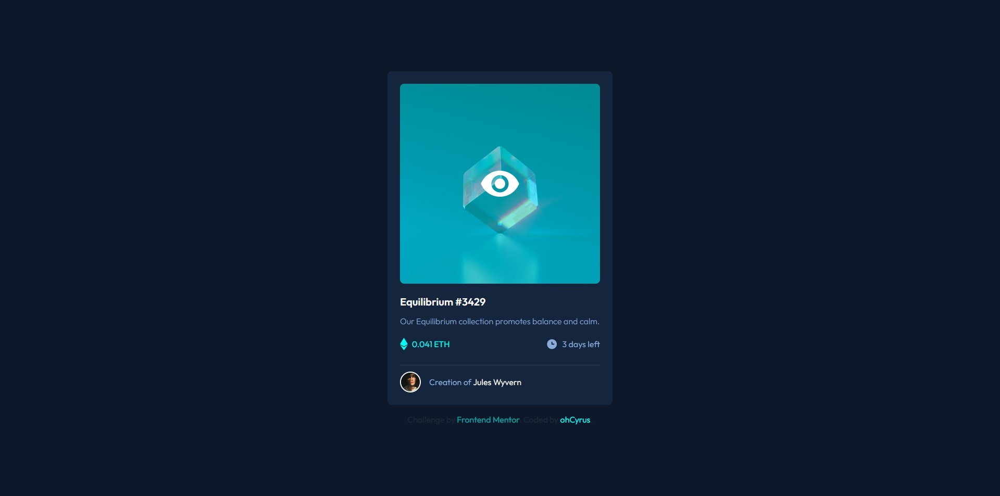
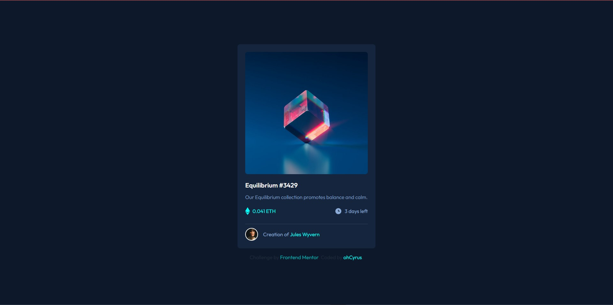
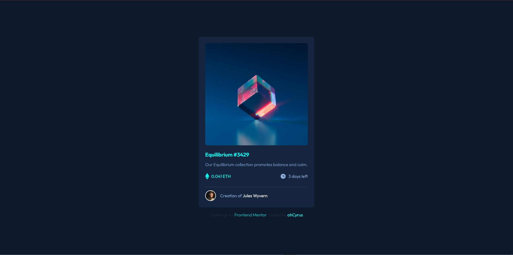

# 📑 Frontend Mentor - NFT preview card component solution

This is a solution to the [NFT preview card component challenge on Frontend Mentor](https://www.frontendmentor.io/challenges/nft-preview-card-component-SbdUL_w0U). Frontend Mentor challenges help you improve your coding skills by building realistic projects.

## Table of contents

- [Overview](#overview)
  - [The challenge](#the-challenge)
  - [Screenshot](#screenshot)
  - [Links](#links)
- [My process](#my-process)
  - [Built with](#built-with)
  - [What I learned](#what-i-learned)
  - [Useful resources](#useful-resources)
- [Author](#author)
- [Acknowledgments](#acknowledgments)

**Note: Delete this note and update the table of contents based on what sections you keep.**

## Overview

### The challenge

Users should be able to:

- View the optimal layout depending on their device's screen size
- See hover states for interactive elements

### Screenshot
#### Hover states






### Links

- Solution URL: [Github Repo](https://github.com/ohCyrus/NFT-Showcase)
- Live Site URL: [Live Site](https://ohcyrus.github.io/NFT-Showcase/)

## My process
1. First I looked at the design images and then I try to create a basic HTML version out of it.
2. I then imported the JIT Compiler (Just in Time) with tailwind's pre script tag
3. Then it's the styling part, I learned how to read documentation and make my own styles.
4. Bug fixing is painful, but it's definity worth it. Meanwhile I fix my code, I took a break and then come back with an solution.

### Built with

- [Tailwind CSS](https://tailwindcss.com/)
- Flexbox
- Mobile-first workflow


### What I learned

I learned how to overlap / create a div block that covers the entire image

```html
<div class="relative cursor-pointer">
  <div class="absolute z-10 w-full h-full bg-[#00fff7]/50 rounded-lg flex justify-center items-center opacity-0 hover:opacity-100 transition">
    
  </div>

  <div class="w-96">
    
  </div>
</div>
```

### Useful resources

- [Flexbox by Kevin Powell](https://www.youtube.com/watch?v=u044iM9xsWU) - This helped me for in-depth explaination of Flexbox and how it's actually work.
- [Grid by Kevin Powell](https://www.youtube.com/watch?v=rg7Fvvl3taU) - This also provide a clear explaination of grid, perfect for beginner.
- [CodePen](https://codepen.io/pen/) -  Useful for testing small CSS code out.
- [TailwindCSS PlayGround](https://play.tailwindcss.com/) - Great for testing Tailwind CSS components / classes out.


## Author
- Frontend Mentor - [@ohCyrus](https://www.frontendmentor.io/profile/ohCyrus)
- Twitter - [@sapwebdev](https://twitter.com/sapwebdev)
